# D20 Project January 2021

My-music-player.

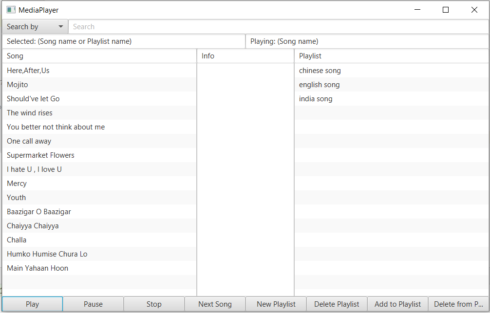

**Written by** :
Jesper Nielsen
Fei Gu
Raheela Tasneem
Ziaullah Hassan

[TOC]

## Introduction

In this project we are going to work on designing and constructing a JavaFX application providing administration of songs and playlists and playing songs.

We showed our process plan with the help of Data flow diagrams. We made Entity relationship Diagrams to design and to have an overview of the database. We are going to correlate our Database SQL Query with the JavaFX program in the next steps. From the end-user’s point of view, the application contains songs and playlists. 

## Requirement

The Desktop application with a GUI - The whole project is developed in IntelliJ as a JavaFX project. - The GUI designer is SceneBuilder (via the .fxml file in the project). - The database used is SQL Server (also using the class DB.java)

The functionality of the app

  With our media player application, the user is able to 

- choose a single song and play/pause/stop the song.

- choose an existing playlist and play/pause/stop this list of songs.

- create a new playlist.

- search for songs by title or by artist.

- edit/delete a playlist.

## The Database

The application is able to play and store music files in the formats .mp3.

All songs are placed physically in the media-folder inside the project.

### Database Setup

Setting up the database is a crucial requisite before the program can function properly. This quick guide will show how to set up the database using a generated script from our database. Make sure that the database name “database_MusicLibrary” is not currently in use.

Remember to change the db. properties too and add your password to the database:

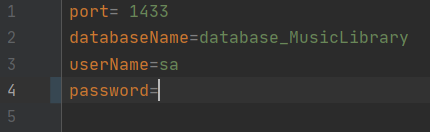

 

Open up SSMS and click on new query:

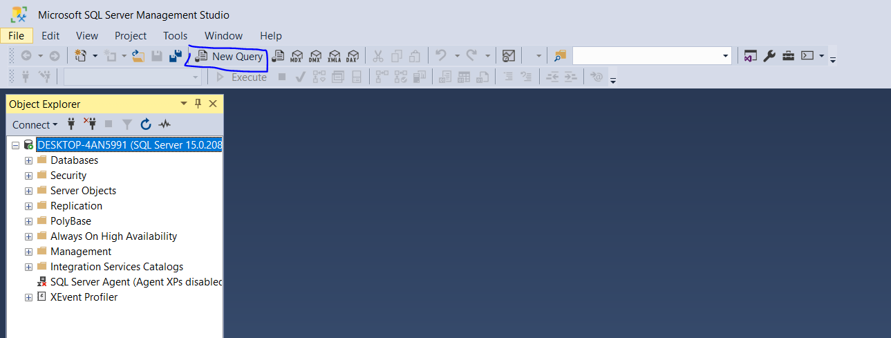

Copy everything from the file CreateMusicDB.sql found under src/DataBase/DBSetter/CreateMusicDB.sql. Now paste everything into the new query window in SSMS: 

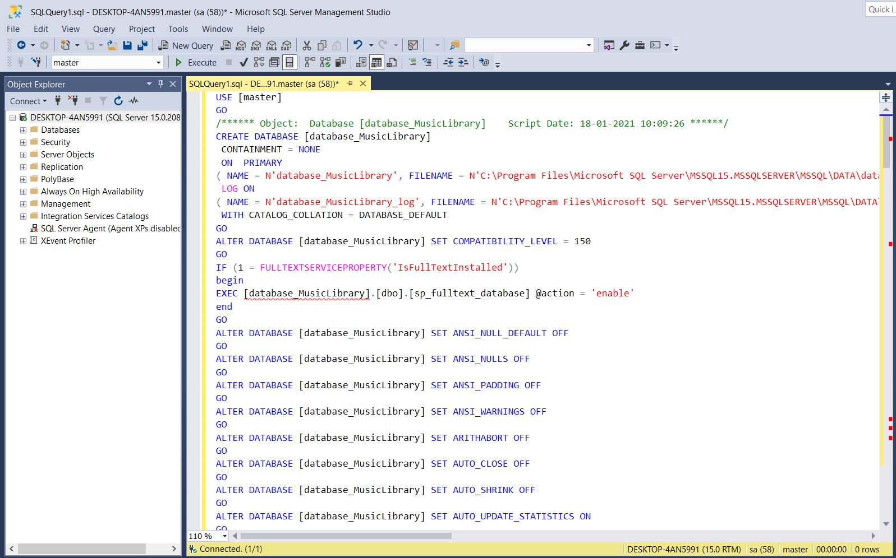

Press execute

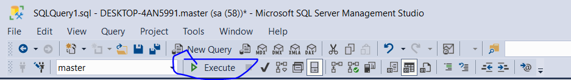

There should be no errors, tested on windows

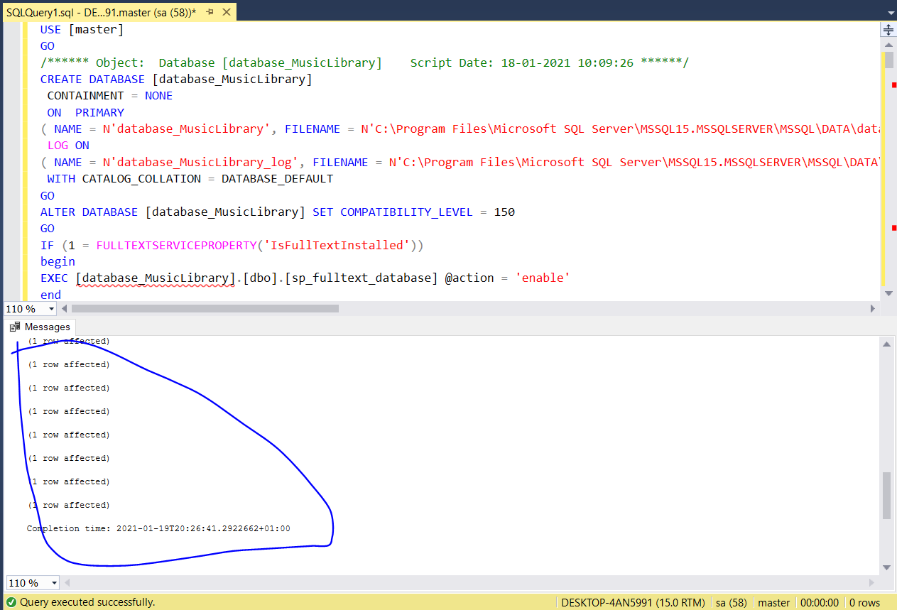

### User guide

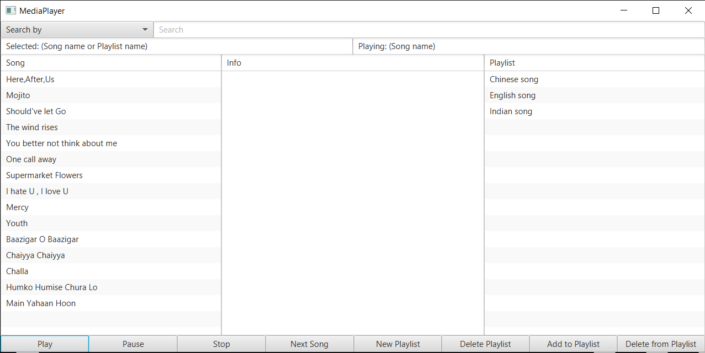

The program visualizes a list of the current songs available for play in the Song Listview (left), an Info Listview (middle), which describes the selected playlist, and a Playlist Listview, which shows the available playlists.

#### Showing playlist information

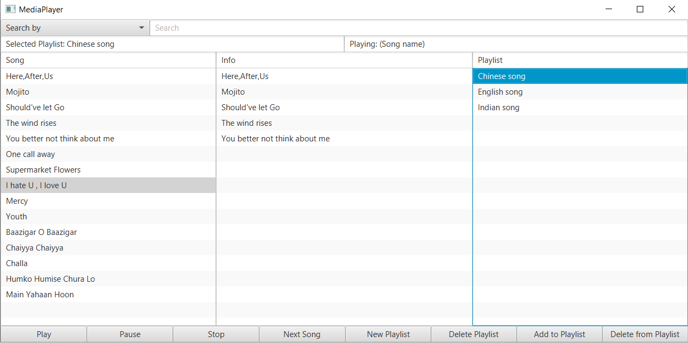

The picture above shows how the program displays the songs of a playlist in the info Listview.

At the top there is a search bar, which can search the database for available songs. Currently the implemented search criterias are, search by title and artist. 

#### Search for a specific song

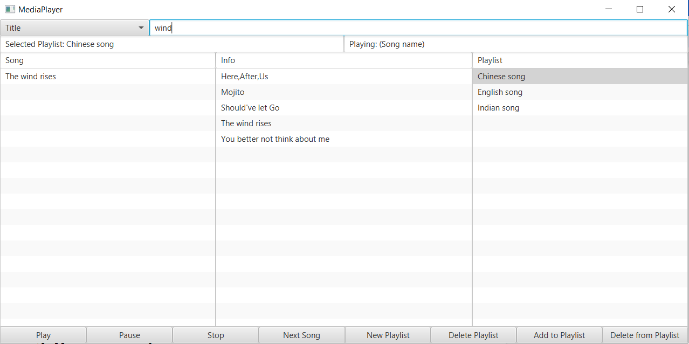

The picture above shows a search for a song name with the search string “wind”.

#### Search songs made by an artist

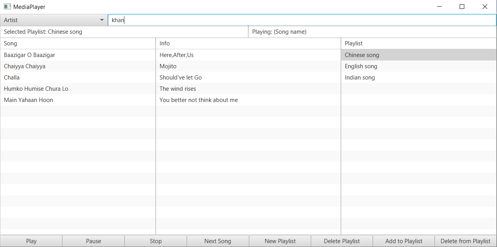

The picture above shows a search by an artist, with the search string “khan”. The result is a list of the songs by this artist.

#### Create a new playlist

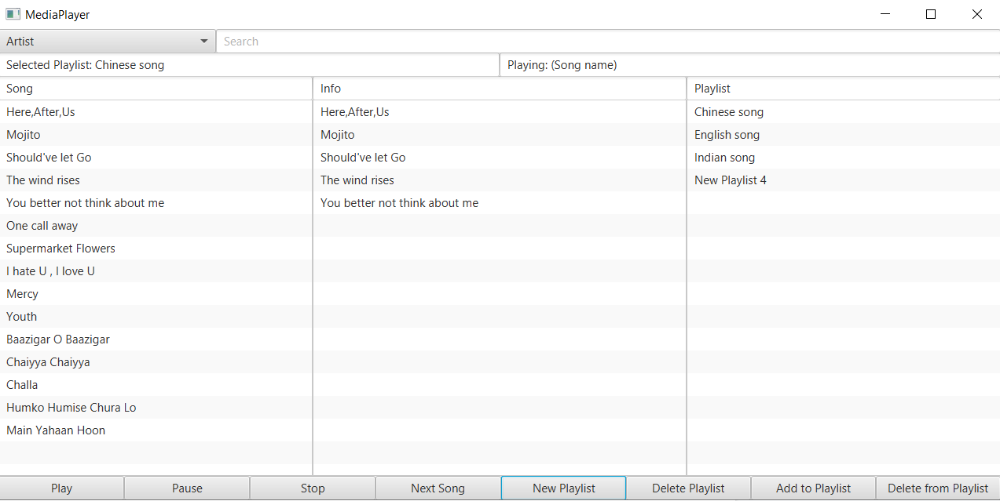

In the picture above, click the new playlist button, and a new playlist should appear in the playlist listview.

#### Edit a playlist name

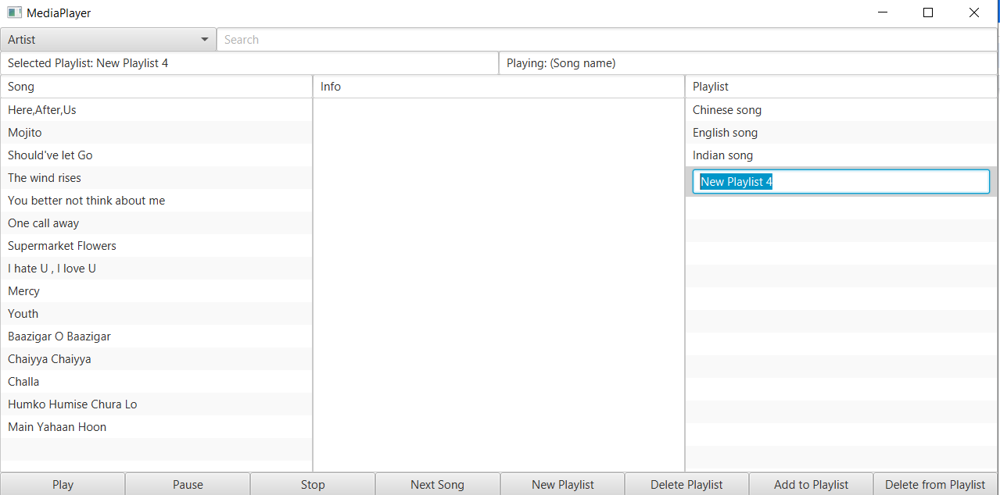

Double click the name of the playlist, if you wish to change the name of it.

#### Add music to playlist

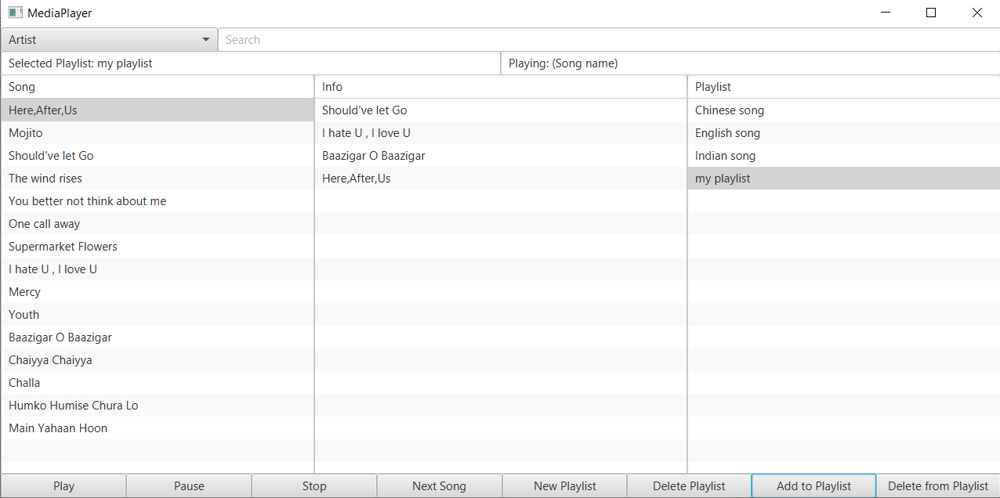

Click the playlist you wish to add music to. Then click on the desired song in the Song ListView and then click on the “Add to Playlist” button.

 

#### Delete music from a playlist

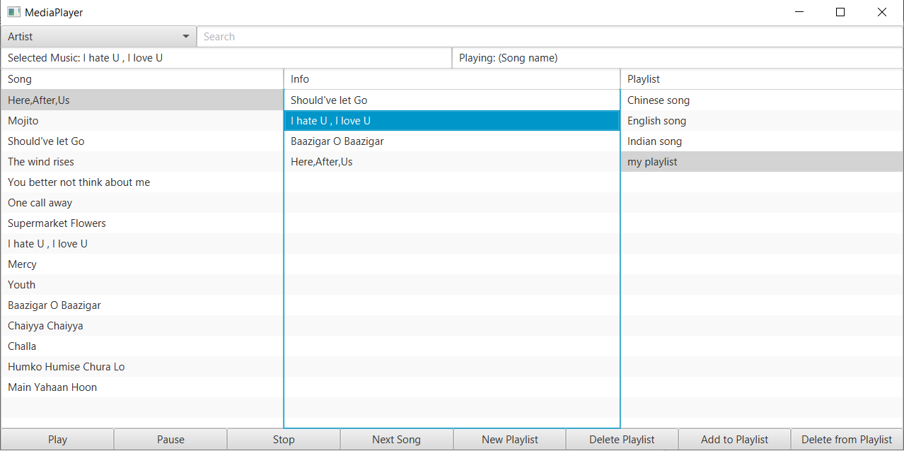

If you wish to delete a song from your playlist, then click on the song you wish to remove and then click on the “Delete from Playlist” button.

 

#### Delete a playlist

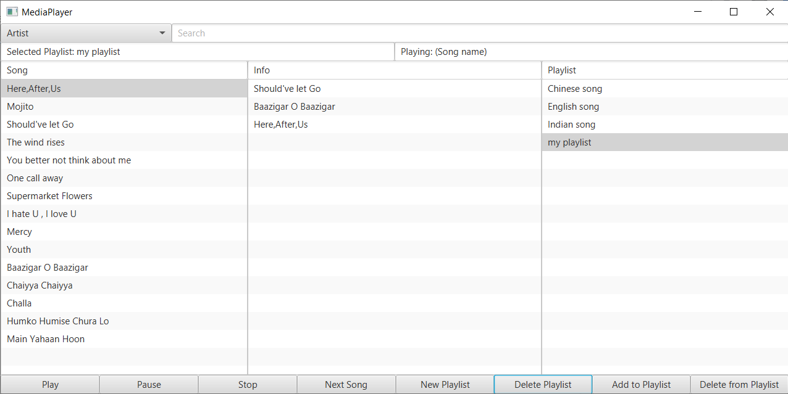

You can at any time delete a playlist by simply clicking on the playlist you wish to delete and then click on “Delete Playlist”

#### Playing a song and a playlist

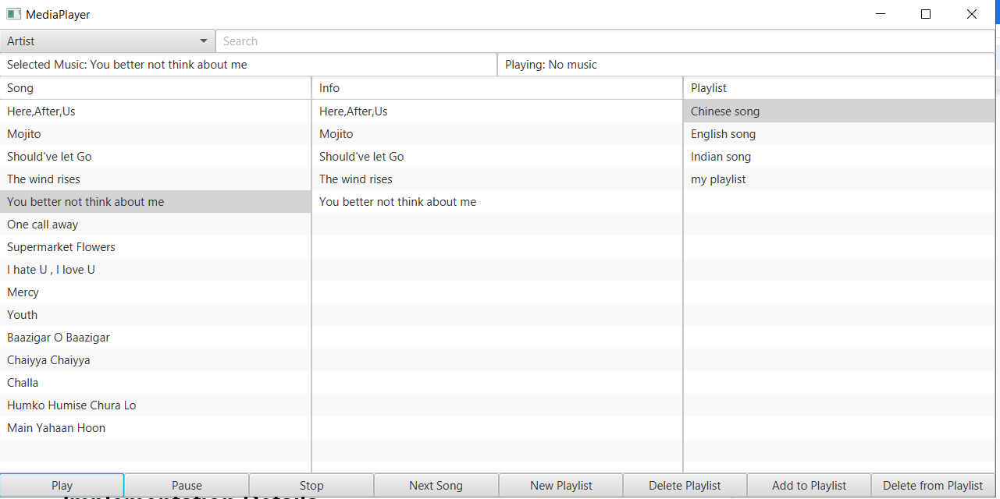

At any time, you can select a song from the song list or a playlist from the playlist list, and then click on the “Play” to play it. Pause the music using the “Pause” button, or stop the music entirely using the “Stop” button. The next button is used, if you want to skip the currently playing song in the song, info or playlist listview.

 

##   Database description

###   ER diagram

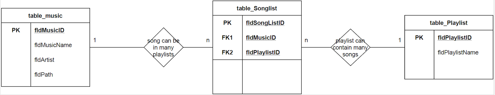

### The components and features of an ER diagram.

**Entity** We have entities Music, SongList and PlayList here

**Attributes**

There are seven fields mentioned in the tableMusic, but we use in our program MusicID, Music Name Artist and Path. Other attributes like Language, Type are just if you want to make further functionality in the app. In tableSongList we have SongListID, MusicID and PlayListID and in tablePlayList we have PlayListID.

**Entity keys**: Refers to an attribute that uniquely defines an entity in an entity set.

**Primary key (PK)**: We have a candidate key that was chosen by the database designer to uniquely identify the entity set. For tableMusic we have fldMusicId as PK.

For tableSongList we have fldSongListId as PK and for tablePlayList we have fldPlayListId as PK.

**Foreign key**: We use FK that is used to identify the relationship between entities.

In tableSongList we have fldMusicId as FK1 to have relation with table table Music and we have fldPlayListId as FK2 to have relation with tablePlayList

#### Relationship

We have entities Music, SongList and PlayList that act upon each other or are associated with each other. One Music or a song could have more Playlists while a Playlist can contain many songs.

#### Cardinality

The entities Music and SongList have 1 to Many relation, while between Songlist and PlayList have Many to 1 cardinality

#### The Playlist as Tables

A playlist is identified by a unique name i.e. in our case Chinese songs, Indian songs and English songs PlayList. These contain a sequence of songs in a specific order.

All playlists saved in the database.

#### The Music Table

This table contains these fields:

- The file path to the media folder – inspect the controller code how the path is used to load the file into the MediaPlayer object.

- The artist name.

- The title of the song.

## Implementation Details

The project as a whole went well, since we were able to fulfill all of the requirements in the problem statement. During the span of the project, we were met with some difficulties with the setup of the database and github. Luckily those problems were solved early on, but it still cost us some time that could have been used somewhere else. 

One of the first problems we met during the programming phase was being able to stop the currently playing music, while at the same time, starting a new music. At this time we were only working with one music object, which contains a media player. This means that, every time we selected a new song from the Song ListView, this object would be reused, thus deleting the currently playing music and then creating a new media player. We solved this problem by using two Music objects.

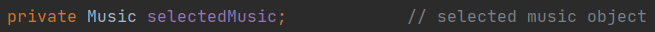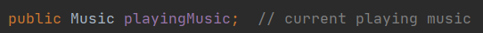

By using this approach, we were able to store the currently playing music inside the music object playingMusic. Whenever we select a new music in the Song ListView, we will store the new information inside the selectedMusic object, thus avoiding the deletion of the current playing music media player.

A great challenge occured, when we had to implement the play button event handler to work with a playlist. We started out by making the play button work with the music objects created, when we select a song in the Song ListView or the Info ListView. However, there was also a class called Playlist, which is a blueprint for the many playlist objects that will be created, when we select a playlist in the playlist ListView. The question was: How can we handle different kinds of objects in the play function? Our solution was to use an interface called Playable. Classes which implement this interface should be able to play, pause and stop music. But since our music class already implements a play, pause and stop function, without the Playable interface, this would lead into code restructure. Many features in the controller class are already dependent on methods found inside the music class and it would take too much time restructuring the whole controller. But one necessary feature could still be used with the Playable interface. As the music class and playlist class will implement the Playable interface, a Playable object can be used in the play button event handler. We can perform conditional tests on this Playable object to determine if the object is of type Music or Playlist:

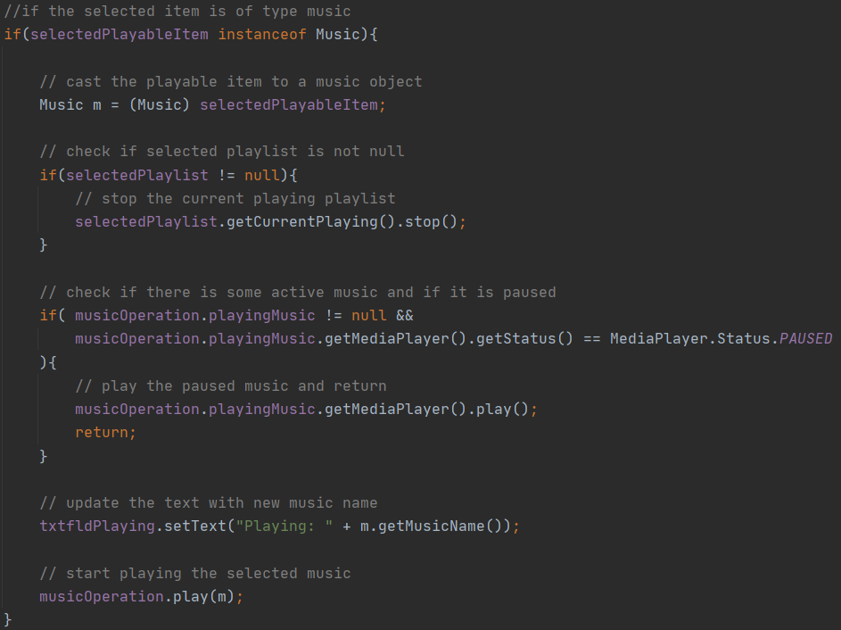

Above is a picture of the code describing what action should be taken, when the selected 

Playable object is of type music.

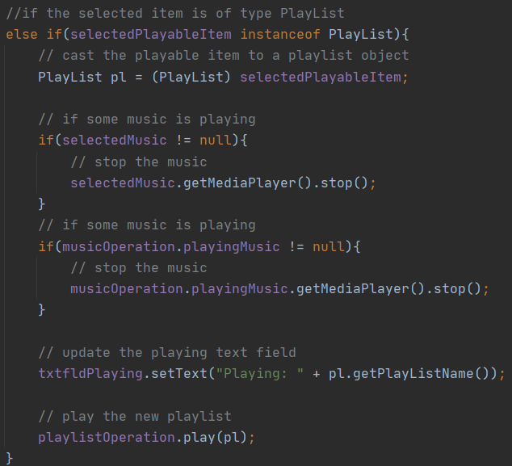

Above describes the actions if the Playable object is of type Playlist.

Even though we had an empty Playable interface, we were still able to code the play button to handle two different kinds of objects. Of course the right approach would be to declare the method headers for play, pause and stop inside the interface Playable. But since we already had implemented it elsewhere, it would cause problems with the existing code.

The next problematic event in the project span was the implementation of playing playlist songs in sequence. We did our research and ended up in the JavaFX documentation of the MediaPlayer class. The class has a method called: 

 

  [setOnEndOfMedia](https://openjfx.io/javadoc/11/javafx.media/javafx/scene/media/MediaPlayer.html#setOnEndOfMedia(java.lang.Runnable))([Runnable](https://docs.oracle.com/javase/10/docs/api/java/lang/Runnable.html?is-external=true)  value)  

This method accepts an implemented Runnable interface function object, which will be called when the Media Player is done playing a media. Our implementation of this function object for each MediaPlayer in the playlist is as follows:

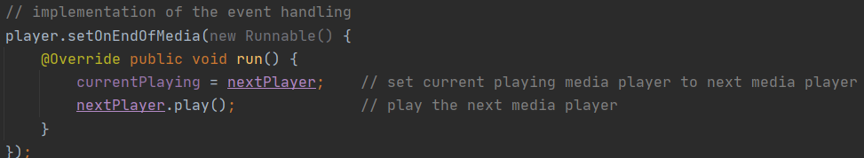

The Media Player currentPlaying will be assigned the next Media Player in the playlist, which is attached to the next song. Then the play function will be invoked on the nextPlayer, playing the music.

The last and quite annoying problem was the amount of null pointer exceptions which occured in the code, when fiddling around with the buttons in the GUI. These exceptions were taken care of, by performing more checks for objects, which could be null.

## Source Control

### Git & Github

During the application development, we try to use Github as the VCS. Our repository name is MediaPlayer created by jesp89g8.

#### The develop process based on the git

##### The beginning

At the beginning of the project we create the whole project based on the Git system. When we clone the repository, all of us have the same empty project as well. Therefore we start coding when we meet together as the traditional way.

But here is a problem: Either we write the code by one and the others should watch and talk, or we can do the separate work and put it together which is more efficient. So we try to use the multiple lines to create the different parts at the same time. we make two basic branches and try to merge it together. One of the branches is the Database setter and music reference. And another way is the user interface design and the basic connect to the controller. These two way was working very well. But the merge of the two branches sometimes is not easy.

 

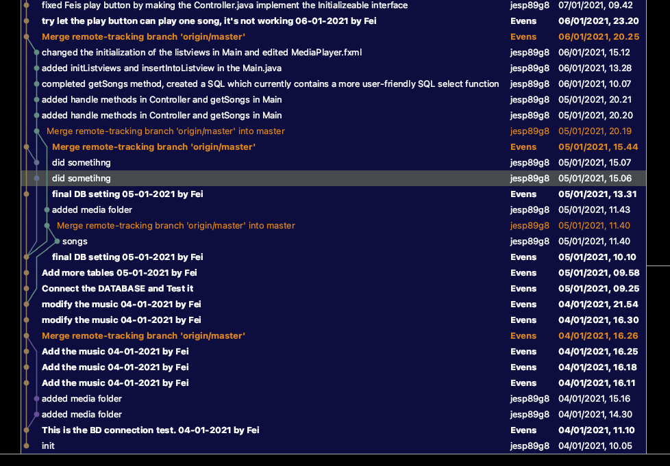

##### The after period

After the exploration of the beginning we have the tacit about this. Before we need programming, we need to update first, and then coding. After that we need ASAP to push the personal change before others push earlier. But once it happens, that will make the hard decision to give up some part of change on the branch.

So the git log after look like this:

 

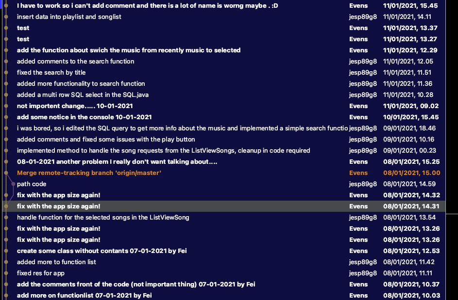

#### The summary of the VCS

We didn’t really use the VCS correctly. We can not make the different branches and merge them with the fine structure. Which in a professional way called “resolve a git merge conflict.”

We can not try to make some different software design and functional test on the VCS because that is hardly to make the program back to working after change.

We didn’t know to use the cherry-pick function. 

Maybe because the project is not necessary to compare with the history record. We never use the function to roll back or compare between the old version and recent version.

 

​       

 

## Github link

 

https://github.com/jesp89g8/MediaPlayer.git

